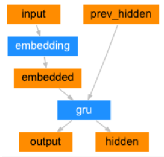
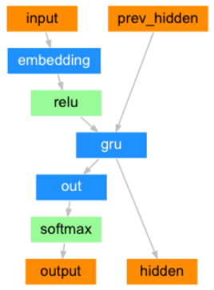
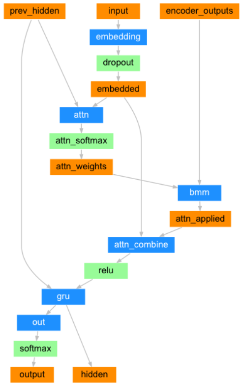
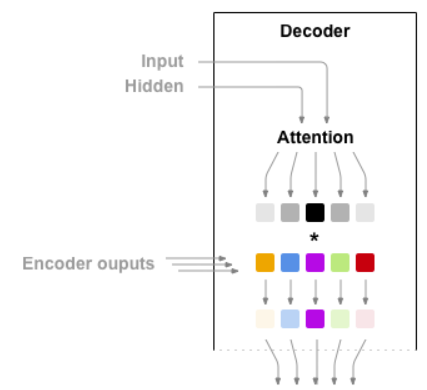

# CS563 Natural Language Processing: Assignment 3
Machine Translation using Seq2Seq and Attention Models.

## Team Details

**Team Code**: `1801cs15_1801cs46`

**Team Name**: `kacha_badam`

### Team Members

| Name              | Roll Number |
| ----------------- | ----------- |
| Bhumika Shivani   | 1801CS15    |
| Shashwat Mahajan  | 1801CS46    |

## Set up and Execution
### Creating environment with the required packages
Use the ```requirements.txt``` file to install the required packages. The environment name here is `nlp-a3`. You may change it if you want.

```
conda create --name nlp-a3 --file requirements.txt
```  

### Activate the new environment
```
conda activate nlp-a3
```

### Running the Code
Run the Jupyter Notebook - `translate.ipynb`.

## Architecture
### Encoder Architecture


### Decoder Architecture


### Attention Decoder Architecture


### Using Attention


## Analysis of Models  

---
#### The Seq2Seq Model
---
_Trained over 50000 sentences._  
_**Time taken for training**: 87 min 20 sec_

_Tested over 2507 sentences._  
**BLEU Score Over Test Set = 0.5530443839910893**

---
#### The Attention Model
---
_Trained over 50000 sentences._  
_**Time taken for training**: 139 min 47 sec_

_Tested over 2507 sentences._  
**BLEU Score Over Test Set = 0.6511479665068118**


______________________
Thanking You!

kacha_badam